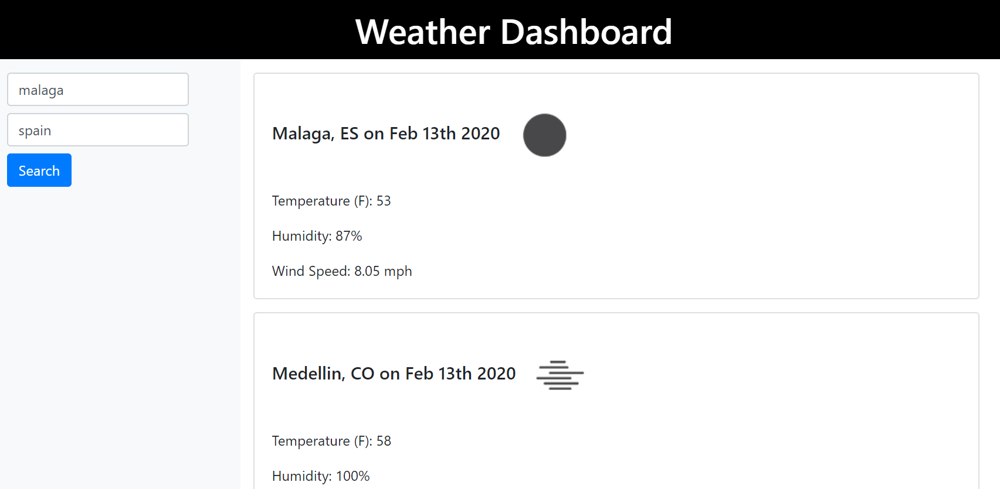

# weatherCards
Weather dashboard is a simple web app that displays just the key weather information for searched cities and continues to show all cities searched.
User can see the temperature, wind speed, and humidity with an icon/representation of the weather.

![GitHub] (https://tantatinta.github.io/weatherCards/)
